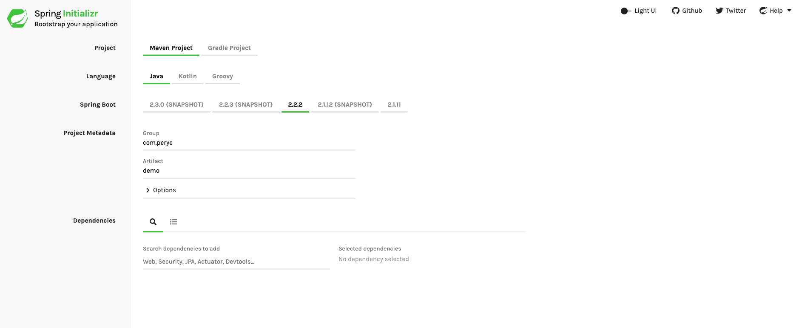
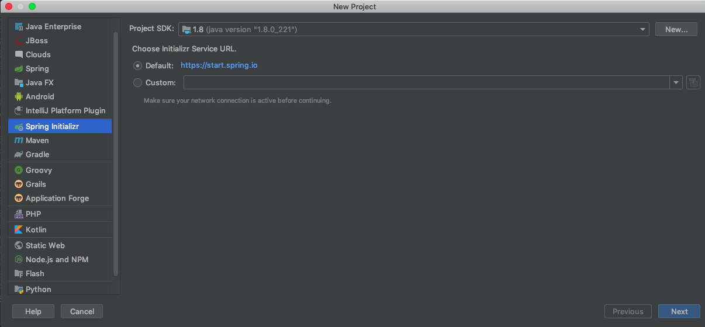
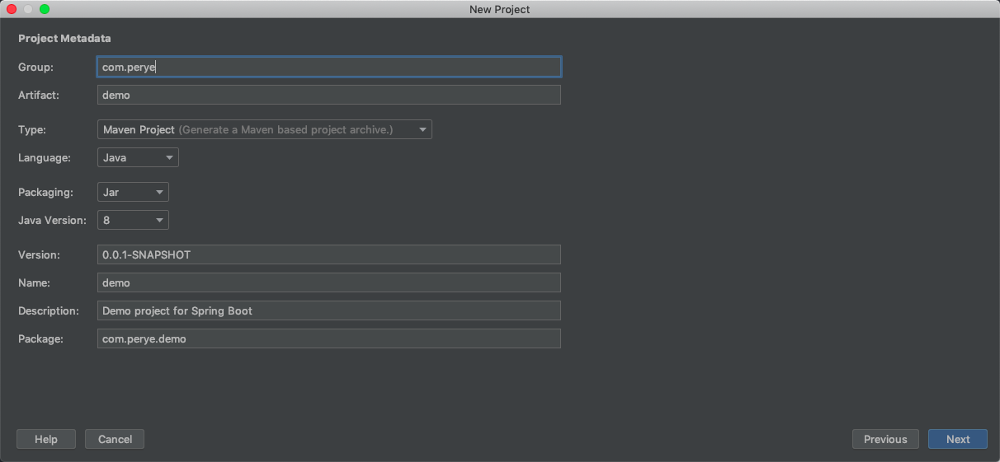
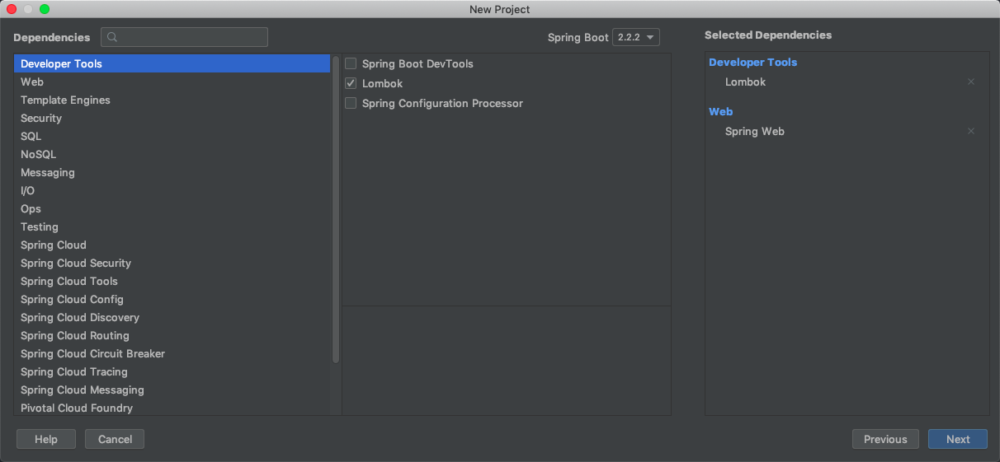
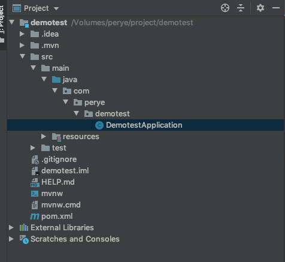
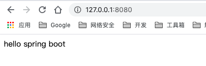

# 开启SpringBoot
SpringBoot是在Spring框架上创建的一个全新的框架，其设计目的是简化Spring应用的搭建和开发过程。开启SpringBoot有许多种方法可供选择，这里仅介绍使用[http://start.spring.io/]() 来构建一个简单的SpringBoot项目。

## 方法一:生成项目文件

访问[http://start.spring.io/]()，页面显示如下：



这里选择以Maven构建，语言选择Java，Spring Boot版本为2.2.2。下方可选择依赖包,然后点击生成即可自动下载.
将项目文件导入IDE中即可使用.

## 方法二:IDEA直接生成(推荐)

创建新项目,选择Spring Initalizr


选Next,然后配置相关信息


选Next,可选择依赖包


项目目录如下所示：



## 简单演示

项目根目录下生成了一个artifactId+Application命名规则的入口类，为了演示简单，不再新建控制器，直接在入口类中编写代码：

```java
package com.perye.demotest;

import org.springframework.boot.SpringApplication;
import org.springframework.boot.autoconfigure.SpringBootApplication;
import org.springframework.web.bind.annotation.GetMapping;
import org.springframework.web.bind.annotation.RestController;

@SpringBootApplication
@RestController
public class DemotestApplication {

    @GetMapping("/")
    String index() {
        return "hello spring boot";
    }

    public static void main(String[] args) {
        SpringApplication.run(DemotestApplication.class, args);
    }

}

```

运行访问[http://localhost:8080](http://localhost:8080),页面显示如下：



## 打包发布
```
mvn clean package
```
在target目录下生成jar包文件,jar可单独运行.
